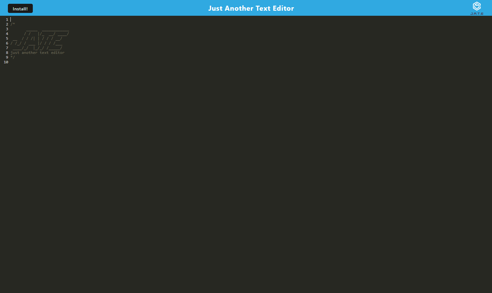
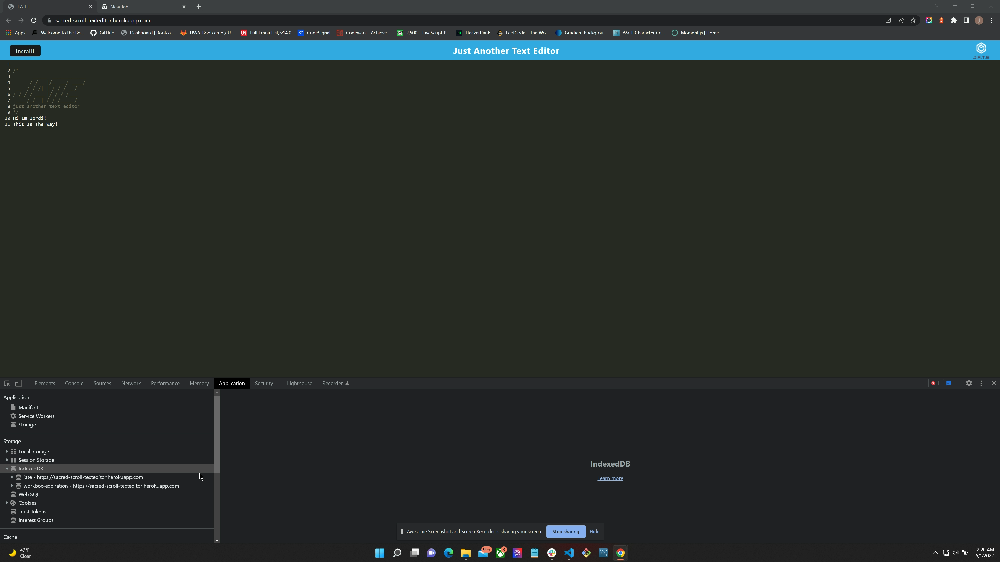
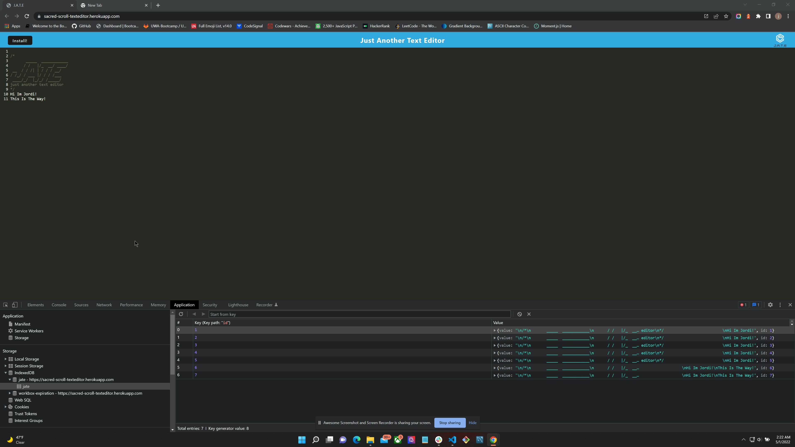

# sacred-scroll-textEditor

## Description

A text editor application that allows the user to download it to use it locally on their computer. Which allows the user to use it when not connected to the web server. 
## Table of Contents

1. [Installation](#installation)
2. [User Story](#User-Story)
3. [Contributers](#contributers)
4. [Screenshots](#screenshots)
5. [Main-Repo](#Project-Repo-w/Heroku)

## Installation

Run `npm i` to install dependencies for back-end. For front end, open the application with Heroku in the links below. Click "INSTALL" to access locally and save data to your device.

## User Story

```md
AS A developer
I WANT to create notes or code snippets with or without an internet connection
SO THAT I can reliably retrieve them for later use
```

## Contributers

Jordi Hernandez

## Screenshots





### Project-Repo w/Heroku

[Heroku](https://sacred-scroll-texteditor.herokuapp.com/)
[GitHub](https://github.com/hernajor133/sacred-scroll-textEditor)

### Main-GitHub w/Developer Info

[Main-Repo](https://github.com/hernajor133)